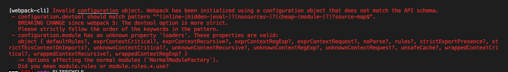

# Webpack 빌드도구

이 장에서는 빌드도구를 활용해서 작성한 코드를 애플리케이션을 실행할 수 있는 최소 단위의 파일로 묶고, 편리하게 배포하도록 준비할 것이다. 우리가 살펴볼 빌드도구는 Webpack(https://webpack.js.org)이다.

이 자에서는 Webpack의 설치, 설정, 프로젝트 적용 방법에 대해 배운다. 또한, 실시간 서버에서 작동 중인 모듈의 변경 사항을 즉시 반영시킬 수 있는 Webpack의 핫 모듈 대체 기능에 대해서도 다룬다. 

## Webpack의 역할

Webpack의 핵심은 작성한 자바스크립트 파일을 최적화하여 적은 수의 파일로 사용자 요청을 처리하는 것이다. 인기있는 사이트의 서버부담을 줄이고, 사용자가 페이지를 불러오는 시간도 줄일 수 있다. 

myUtil이라는 유틸리티 모듈을 account.jsx, transaction.jsx등 여러 React 컴포넌트에 사용하고 있다고 가정해보자. Webpack 같은 도구를 사용하지 않으면 개별 컴포넌트를 사용할 떄마다 수동으로 myUtil을 의존성으로 추가해주어야 한다. 또한, myUtil을 의존하고 잇는 다른 컴포넌트에서 이미 myUtil을 불러온 후에 불필요하게 두세번씩 다시 불러오게 될수도 있따. 물론 이것은ㅇ 매우 단순한 예시에 불과하다. 실제 프로젝트에서는 서로 다른 모듈에서 의존하는 수십 혹은 수백 가지의 의존 모듈이 존재하기도 한다. 이런 상황에 Webpack을 이용하면 도움을 받을 수 있다.

Webpack은 세 가지 자바스크립트 모듈인 CommonJS, AMD, ES6모듈을 모두 지원한다. 따라서 여러 가지 모듈이 뒤죽박죽된 상황이라도 걱정할 필요가 없다. Webpack이 프로젝트 내 모든 자바스크립트의 의존성을 분석한 후 다음과 같은 작업을 수행한다.
- 모든 의존 모듈을 올바른 순서로 불러오도록 한다.
- 모든 의존 모듈을 한 번씩만 불러오도록 한다.
- 자바스크립트 파일이 가능한 한 적은 파일로 묶여지도록 한다. 

Webpack은 코드 분리와 정적자원에 대한 해시적용 기능도 지원하므로 특정 상황에서만 필요한 코드 블록을 정의할 수 있다. 

이책에서는 다음과 같은 작업에 Webpack을 사용한다. 
- npm의존 모듈을 관리하고 번들링하여 일일이 인터넷에서 내려받거나 HTML의 &lt;script&gt;태그에 추가하지 않아도 사용할 수 있도록 한다. 
- JSX를 일반적인 자바스크립트로 변환하고 디ㅓ깅 편의를 위해 소스맵을 제공한다.
- 스타일을 관리한다.
- 핫 모듈 대체를 적용한다.
- 개발용 웹 서버(webpack-dev-server)를 실행한다.

webpack.config.js 파일을 이용하면 Webpack의 로드, 전처리, 번들링 과정을 설정할 수 있다. 

---

## 프로젝트에 Webpack 적용하기

다음 단계에 따라 실습이 진행된다.

1. Webpack 설치하기
2. 의존 모듈을 설치하고 package.json에 저장하기
3. webpack.config.js를 통해 Webpack 설정하기
4. 개발 서버(webpack-dev-server)와 핫 모듈 대체 설정하기

### Webpack과 의존모듈 설치
Webpack을 사용하려면 package.json에서 볼 수 있는 것처럼 몇 가지 의존 모듈을 추가해야 한다.
- Webpack: 번들러 모두(npm 패키지 이름은 webpack이다.)
- 로더 : 스타일, CSS, 핫 모듈 대체, Babel 및 JSX전처리기.package.json파일에 명시된 버전을 사용한다.
- Webpack 개발 서버 : Express기반의 개발 서버로 HMR 기능을 사용할 수 있다. 

github 저장소에 있는 package.json을 프로젝트에 복사후 npm i 혹은 npm install을 실행하여 의존모듈을 설치한다.

### Webpack 설정

Webpack이 번들링하기 위해서는 처리할 대상(소스코드)과 로더를 이용한 처리 방법을 전달받아야 한다. 이런 역할을 하는 것이 프로젝트 최상위에 있는 webpack.config.js 파일이다. 우리가 살펴볼 프로젝트에서 Webpack으로 처리하는 일을 간단히 정리하면 다음과 같다. 

- JSX 파일을 자바스크립트 파일로 변환한다. : babel-loader babel-core, babel-preset-react
- css-loader를 이용해서 require로 CSS를 불러오고, url과 imports를 처리한다.
- style-loader를 이용해서 CSS를 &lt;style&gt; 태그로 삽입한다.
- 모든 자바스크립트 파일을 bundle.js 파일이라는 하나의 파일로 묶는다.
- 소스맵을 통해 개발자 도구에서 적절하게 소스 코드의 행을 확인할 수 있다. 

Webpack의 기능은 많지만 여기서는 기본적인 기능만 다룬다. JSX를 컴파일하고, 소스맵을 생성하고, CSS를 불러와서 삽입하고, 자바스크립트를 하나의 파일로 묶는 과정을 실행하는 데는 어려움이 없을 것이다. 

---
## 코드 모듈화

12장 이전에는 전역 객체와 &lt;script&gt;를 사용했다. 간단한 앱에서는 나쁘지 않은 방법이다. 그렇지만 규모가 큰 앱에서 전역을 사용하면 이름이 충돌하거나 여러 개의 &lt;script&gt;태그가 중복으로 포함되지 않도록 관리해야 하는 문제가 생길 수 있다. 이 경우 CommonJS의 문법을 사용해서 Webpack에 의존성을 맡길 수 있다.

```
require('../css/main.css') 

const React = require('react') -- React를 불러온다.
const ReactDOM = require('react-dom') -- ReactDOM을 불러온다.
const Content = require('./content.jsx')

ReactDOM.render(
    <Content/>
    , document.getElementById('content')
)
```
```
<!DOCTYPE html>
<html lang="en">
<head>
    <meta charset="UTF-8">
    <meta name="viewport" content="width=device-width, initial-scale=1.0">
    <title>Document</title>
</head>
<body>
    <div id="content" class="container"></div>
    <script src="js/bundle.js"></script>
</body>
</html>
```

기존의 HTML과 다른 점은 index.html에서 스타일시트 main.css파일을 부러오지 안흔다는 점이다..app.jsx에서 require('main.css')로 main.css 파일을 불러오므로 Webpack이 index.html의 &lt;style&gt;요소 안으로 CSS파일을 사빕한다. bootstrap.css도 require를 통해 불러올 수 있다.


이제 비륻 실습을 할 차례인데, 뭔가 책대로 하면 빌드가 되지 않는다.. (쓰여진지 오래되어서 버전문제 때문에 그런듯..)
일단, 이상태에서 1차 커밋을 하고 리서치를 하면서 빌드 방법을 알아보도록 한다. 

```
$ npm init -y
$ npm install --save-dev @babel/core babel-loader @babel/preset-react @babel/preset-env 
$ npm install --save-dev webpack webpack-dev-server webpack-cli html-webpack-plugin
$ npm install style-loader --save
$ npm i react --save
$ npm i react-dom --save
$ npm i css-loader --save

$ npm run build <-- 요 스크립트는 책에있는 script코드를 package.json에 넣어서 build 스크립트 추가한거
```

그래도 다음과 같은 버그가 떳었지만, 의존성 문제로 위의 npm install 작업을 수행하면 해결이 됨!!!


```
module: {
    loaders: [{

module: {
    rule: [{

```

## Webpack의 실행과 빌드 테스트

npm run build를 수행하여 실행 후 오류가 없고 js 폴더에 bundle.js파일과 bundle.js.map 파일이 생성되었다면 성공적이다! 

책에서는 한가지 더 설정해볼 것을 추천하는데, 그건 핫 모듈 대체(HMR) 이다. 

--- 
## 요약

- 핫 모듈 대체를 작동시키려면 webpack-dev-server를 사용하고 설정에 react-hot-loader를 추가하거나 원하는 파일에 module.hot.accept()를 적용하여야 한다.
- style-loader와 css-loader를 사용하면 require()문으로 css를 불러올 수 있따.
